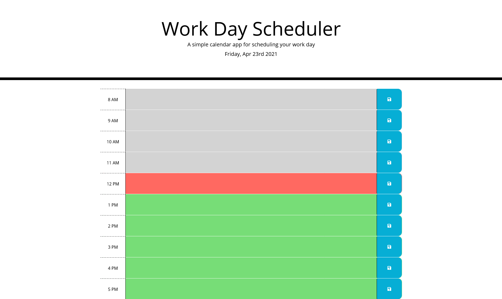

# Work-Day-Scheduler

This assignment required us to create a workday scheduler to help assist folx with schedule organization by creating a daily planner. The planner will utilize HTML and CSS in conjunction with jquery, bootstrap, and javascript functions.

# User Story

AS AN employee with a busy schedule
I WANT to add important events to a daily planner
SO THAT I can manage my time effectively

# Description

Daily planners or schedulers help folx to organize their schedules better. It allows those to best plan out their days to best complete daily tasks and get work done.

# Considerations

As I worked through the assignment, it's best to keep in mind what variables and functions to create while utilizing jquery (and keeping bootstrap in mind) to ensure complete functionality of the timetables and hour stamps. In addition to saving logs into the users' local storage.

# Acceptance Criteria

GIVEN I am using a daily planner to create a schedule
WHEN I open the planner
THEN the current day is displayed at the top of the calendar
WHEN I scroll down
THEN I am presented with timeblocks for standard business hours
WHEN I view the timeblocks for that day
THEN each timeblock is color coded to indicate whether it is in the past, present, or future
WHEN I click into a timeblock
THEN I can enter an event
WHEN I click the save button for that timeblock
THEN the text for that event is saved in local storage
WHEN I refresh the page
THEN the saved events persist

# Contributors

Angelica Sargent

# Screenshot

# Link
Take a look at this [link](https://agraysargent.github.io/Work-Day-Scheduler/).